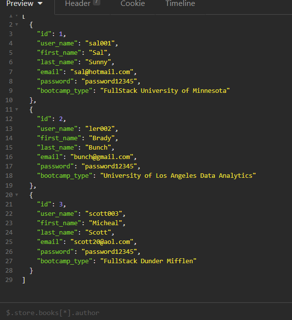

  # ECommerce Backend

## Badges

## Description

A database app allowing you to keep track of inventory in an online store.
[Link to video of route testing](https://watch.screencastify.com/v/xBeeRAvOJbED0kafbLeG)

## Table of Contents

- [Badges](#Badges)
- [Installation](#installation)
- [Usage](#usage)
- [Credits](#credits)
- [License](#license)
- [Tests](#tests)

## Installation

1. Install all packages with npm i.

## Usage

This project only includes a back end. Using a back end tester (Insomnia), you can test all of the routes.

## Credits

- [powe0186](https://github.com/powe0186)

## License

### MIT

    MIT License:
    A short and simple permissive license with conditions only requiring preservation
    of copyright and license notices. Licensed works, modifications, and larger works
    may be distributed under different terms and without source code.

[CLICK FOR MORE ABOUT LICENSE](https://choosealicense.com/licenses/mit/)

## Tests

## My Github & Email

- [https://github.com/powe0186](https://github.com/powe0186)
- [powe0186@gmail.com](mailto:powe0186@gmail.com)

